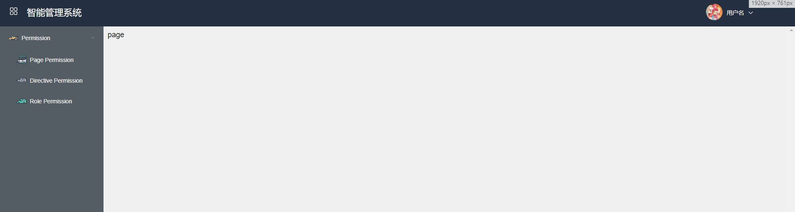

# templevuecli   --这只是一个vuecli3 模板


<!-- 已安装插件 -->
1. vue-router
2. vuex
3. dart-sass
4. babel
5. Eslint+Prettier



## Project setup
```
yarn install
```

### Compiles and hot-reloads for development
```
yarn run serve
```

### Compiles and minifies for production
```
yarn run build
```

### Run your tests
```
yarn run test
```

### Lints and fixes files
```
yarn run lint
```

### Customize configuration
See [Configuration Reference](https://cli.vuejs.org/config/).
